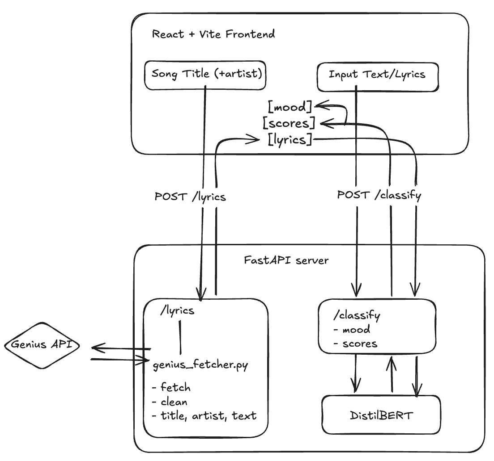

# System Design Doc - moodverse

**Project:** moodverse, a lyric/text mood classifier

**Author:** Elian Moreno (frontend, API contract, `/classify` endpoint & model serving, integration)


**Scope note:** This doc covers the whole system for architectural context, but design authority and implementation detail are deepest in the areas I owned. Teammate-owned components (Genius lyrics pipeline, model fine-tuning) are described at the interface level and credited as such.

---

## 1. Problem Statement

People describe music by feel but there's no quick way to get an objective read on the emotional tone of a piece of text or a song's lyrics. moodverse aims to tackle this issue by returning what the overall mood of the pasted text or provided song title is using the following mood classes: happy, sad, angry, and relaxed.

Secondary goal: as a team project, the system needed to be buildable **in parallel**. Frontend, lyrics pipeline, and model were owned by different people on different timelines. The architecture had to let each part progress without blocking on the others.

## 2. Requirements

### 2.1 Functional

- FR1: Users can paste arbitrary text and receive a mood classification
- FR2: Users can look up a song by title (artist optional, used for disambiguation); the system fetches its lyrics and classifies them
- FR3: The response includes the top mood, its confidence, and the probability of every mood class 
- FR4: The UI clearly communicates loading, "song not found," and empty-input states
- FR5: Song lookups display the resolved song title and artist alongside the result, so users can confirm the right song was matched

### 2.2 Non-functional

| Dimension | Target | Rationale |
|---|---|---|
| Inference latency | Interactive (~1-2s perceived) after model warm-up | Live demo tool; users wait on a spinner |
| Cold start | Model loads once at server startup, not per request | Per-request loading would add multi-second latency to every call |
| Concurrency | Single user / demo scale | Local tool, never deployed |
| Availability | Best effort; graceful degradation when Genius is unreachable | Paste-text mode must keep working even if lyrics lookup fails |
| Consistency | Stateless; no persistence | Every request is self-contained |

## 3. Constraints & Assumptions

**In scope:** two input modes, four-class mood classification, full probability breakdown, local single-machine deployment.

**Explicitly out of scope:** user accounts, request history, deployment/hosting, caching of lyrics or classifications, the confusion-matrix results view (designed but cut), song recommendations, Spotify metadata enrichment.

**Constraints:**
- **Copyright constrained the dataset choice.** No public dataset ships raw lyrics. MoodyLyrics4Q (Erion Çano) provides mood labels in four valence/arousal quadrants without redistributing lyric text, which fixed the class set at angry / happy / relaxed / sad.
- **Team parallelism.** Three workstreams (frontend, lyrics pipeline, model) needed to be done independently which drove the mock-first API contract approach (see 7.1).
- **Single shared port.** One FastAPI process on port 8000 serves both endpoints; two teammate server files had to be reconciled into one (see 7.4).

**Assumptions:** English-language lyrics; users tolerate a one-time startup delay while the model loads; Genius's top search hit is usually the intended song (mitigated by the optional artist field).

## 4. Back-of-Envelope Estimation

Deliberately brief since this is a local, single-user demo tool, and the estimation exists mostly to justify *not* adding infrastructure:

- Load: one user, a handful of classifications per minute at peak (demo). No queueing, caching, or horizontal scaling is warranted.
- Model memory: DistilBERT fits comfortably in RAM/VRAM on a laptop which is a deciding factor in serving it in-process rather than behind a separate model server.
- Payloads: lyrics run ~1–3 KB of text; responses are <1 KB JSON. Bandwidth is a non-issue.
- **Conclusion:** a single FastAPI process with the model held in memory is the correct amount of architecture for this tool. The first thing that would break at real scale is concurrent inference on one model instance (see 8, F5).

## 5. Data Model & Contracts

The system is stateless, no database exists. The "data model" is the pair of API contracts, which I designed and which functioned as the team's integration boundary.

### 5.1 `/classify` contract (mine)

```jsonc
// POST /classify
{ "text": "<lyrics or pasted text>" }

// 200
{
  "mood": "Happy",             // argmax label
  "confidence": 0.75,          // probability of the top mood
  "probabilities": {           // full distribution, sums to ~1.0
    "happy": 0.75, "relaxed": 0.14, "angry": 0.06, "sad": 0.05
  }
}
```

Design choice: return the **full distribution**, not just the argmax. The frontend renders it as the mood-breakdown bars, which makes low-confidence results visibly ambiguous instead of silently misleading. It also meant zero contract changes when the mock endpoint was swapped for real inference.

### 5.2 `/lyrics` contract (teammate-owned pipeline; contract shared)

```jsonc
// POST /lyrics
{ "title": "Something in the Way", "artist": "Nirvana" }  // artist optional

// 200 -> cleaned lyrics + resolved song metadata
// 404 -> "Song not found"
```

### 5.3 Access pattern

One pattern only: frontend -> (`/lyrics` ->) `/classify`, orchestrated client-side. The frontend chains the calls for song lookups; the backend endpoints never call each other. This keeps each endpoint independently testable with `curl` and made ownership boundaries match code boundaries.

## 6. Architecture & Data Flow



**Song-lookup request lifecycle:**

1. User submits title (+ optional artist) -> frontend validates non-empty input, enters loading state
2. `fetchLyrics()` -> `POST /lyrics` -> Genius API -> metadata cleanup (contributor counts, translation links, "Read More" headers are stripped) -> cleaned lyrics + resolved song metadata returned to then be classified
3. Frontend calls `POST /classify` with the lyric text
4. Text is tokenized, truncated to the model's max sequence length, run through DistilBERT
5. Frontend renders the top mood, confidence, and per-mood bars

The paste-text flow is steps 3–5 only.

## 7. Key Decisions & Alternatives Considered

### 7.1 Mock-first API contract (the load-bearing decision)

The frontend was built entirely against mock `fetchLyrics` / `classifyMood` functions before either the lyrics pipeline or the model existed. I defined the response shapes up front, built the whole UI against them, and shipped a mock `/classify` endpoint on the server so integration could be rehearsed end to end.

- **Alternative considered:** wait for the real backend pieces, build the UI against them.
- **Outcome:** when the fine-tuned model was ready, swapping mock inference for real inference changed the endpoint internals and **zero frontend code**. The contract held.

### 7.2 Isolated API client layer (`src/api/index.js`)

All network calls live in one module; components import functions, not `fetch`. Swapping mock and the real implementation was a one-file change, and error handling is centralized.
- **Alternative:** fetch calls inline in components. However this scatters the mock/real boundary across the UI.

### 7.3 Model loaded at server startup

The DistilBERT model and tokenizer are loaded once when FastAPI boots and held in memory for the process lifetime (no need for GPU).
- **Alternative:** load per request. This however would add seconds of latency to every classification for zero benefit at this scale.
- **Alternative:** separate model server (e.g., TorchServe). This would be an extra process and network hop to serve one small model to one user. (see 4) says no.
- **Tradeoff accepted:** slower server boot and permanent memory footprint; both are fine for a local tool.

### 7.4 One unified FastAPI server

Mid-project, two server files existed: a teammate's `server.py` (`/lyrics`) and my `main.py` (mock `/classify`) — which can't both bind port 8000. We consolidated on the teammate's file as the base and I added `/classify` to it.
- **Alternative:** two services on two ports. However there's no need as this just adds complexity for a tool one person runs locally.

### 7.5 Client-side orchestration of the two-call flow

The frontend chains `/lyrics` -> `/classify` rather than having a combined `/classify-song` backend endpoint.
- **Why:** keeps endpoints single-purpose and independently ownable (the team boundary ran exactly along this line), and lets the UI show intermediate state (resolved song) between the calls.
- **Tradeoff:** two round trips instead of one but irrelevant on localhost.

### 7.6 Full probability distribution in the response

Covered in 5.1. The one-sentence version: an interpretable result beats a bare label, and the UI was designed around showing uncertainty.

## 8. Failure Modes


| # | Failure | Behavior as built |
|---|---|---|
| F1 | Genius has no match for the title/artist | `/lyrics` returns 404; frontend shows a "song not found" state and prompts the user to add/adjust the artist |
| F2 | Genius is slow or unreachable | Frontend loading state persists; request eventually errors and the UI surfaces it. Paste-text mode is unaffected (degradation is partial, by design) |
| F3 | Genius matches the *wrong* song | Resolved title/artist are displayed with the result so the user can catch it; the optional artist field exists specifically to prevent this |
| F4 | Metadata leakage into lyrics (contributor headers, translation links) | Occurred in practice; polluted classifier input. Fixed in the teammate's cleanup pass in `genius_fetcher.py` however still persists for some songs. The classifier happily classifies garbage (see section 10) |
| F5 | Concurrent `/classify` requests | Single in-memory model, no queue. Fine for one user; the first real bottleneck at scale |
| F6 | Empty or whitespace input | Rejected client-side before any network call |
| F7 | Input exceeds model max sequence length | Truncated at tokenization. Long lyrics are classified on their opening section only (a known, accepted limitation) |
| F8 | Server started before model weights present | Startup fails loudly rather than serving a broken `/classify` request |

## 9. Rollout & Observability

Local tool, so this section is proportionally small: the "rollout" was iterative integration in a fixed order consisting of UI on mocks -> real `/lyrics` verified with `curl` -> real `/classify` swapped in -> end-to-end runs. Health signals were manual: server logs for request/response inspection, and eyeballing the probability distribution for degenerate outputs (e.g., near-uniform distributions on obviously moody text, or the F4 metadata bug showing up as nonsense classifications).

If this were deployed, the first three metrics I'd add: `/classify` p95 latency, Genius 404/error rate, and top-mood confidence distribution over time (a drift canary).

## 10. What I'd Do Differently

- **Validate classifier input, not just user input.** F4 taught the real lesson: the model trusts whatever text reaches it. A sanity check between `/lyrics` and `/classify` (minimum length, junk-pattern detection) would have caught the metadata bug at the boundary instead of in the outputs.
- **Ship the confusion matrix view.** It was designed and cut for time. It's the single most honest UI feature a classifier demo can have since it shows users *where* the model confuses Relaxed with happy.
- **Chunk long lyrics instead of truncating.** Classify per-chunk and aggregate (mean or max over the distribution) so the whole song is taken into account.
- **Pin the contract in code.** The API contract lived in shared understanding and mock functions. A Pydantic response model for `/classify` (and ideally a shared JSON schema) would make the contract self-enforcing.